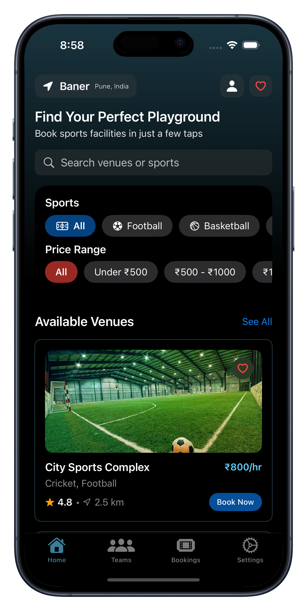
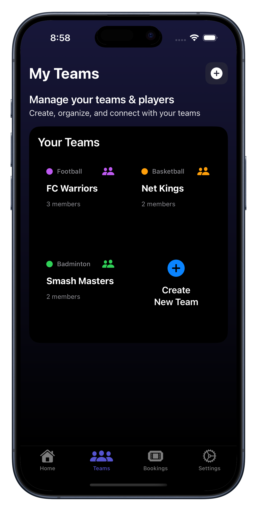
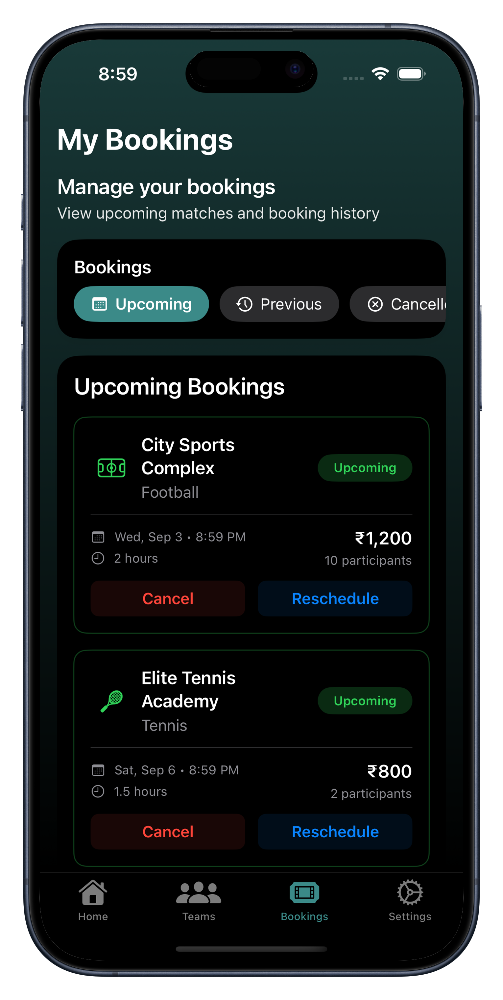
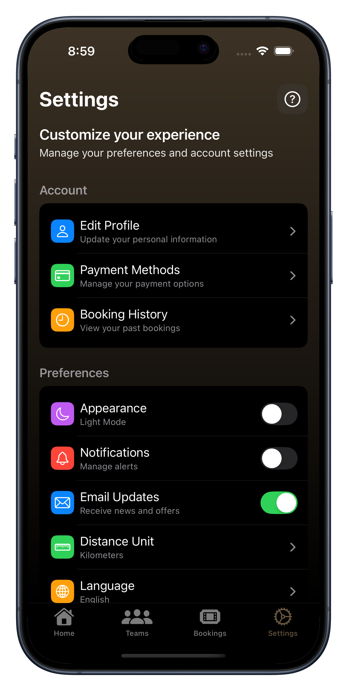
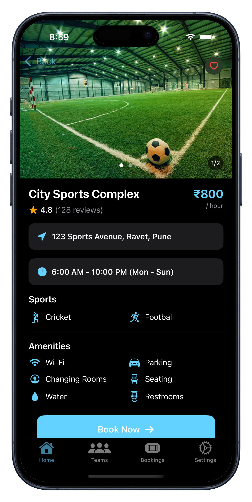
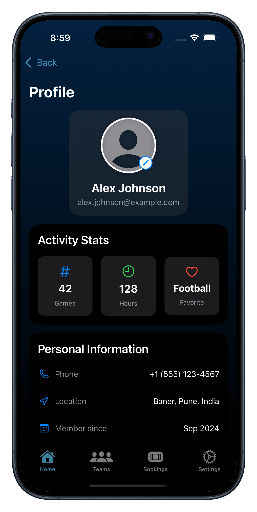

# PlayCes

## Overview

PlayCes is a sports ground booking app designed to help users easily find and reserve sports grounds. The app allows users to manage their teams, book available slots for various sports facilities, and handle reservations seamlessly. Whether organizing a casual game or managing a sports league, PlayCes streamlines the booking process for players and team managers alike.

## Features

- Home page with easy navigation to browse available sports grounds and bookings
- Team management to create and organize players and teams
- Booking slots for sports grounds with real-time availability
- Settings to customize user preferences and notifications
- Notifications to keep users updated on bookings, cancellations, and reminders

## Tech Stack

- **Swift & SwiftUI**: For building a smooth and intuitive user interface tailored to iOS devices.
- **Xcode**: The development environment used to create and test the app.
- **iOS**: Target platform providing seamless integration with Apple devices.
- **Firebase**: Backend services for user authentication, real-time database, and push notifications to handle bookings and team data efficiently.

## Roadmap

- A fast and secure database management system for efficient booking, team, and user data operations
- Integration of payment gateways for secure and easy booking payments
- Location-based search to find nearby sports grounds
- Support for recurring bookings and automated reminders
- Enhanced team collaboration features including chat and event scheduling
- Admin panel for ground owners to manage availability and pricing

## Screenshots

## 🧑‍💻 Author

**Shantanu Tapole**  
